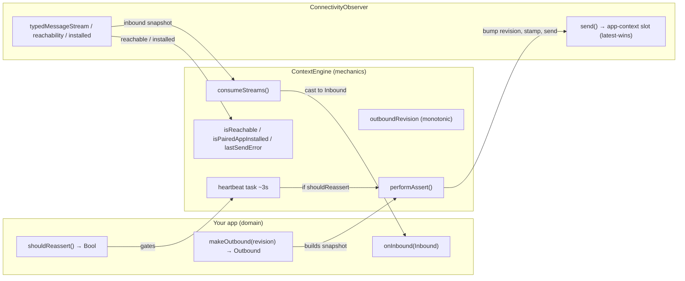
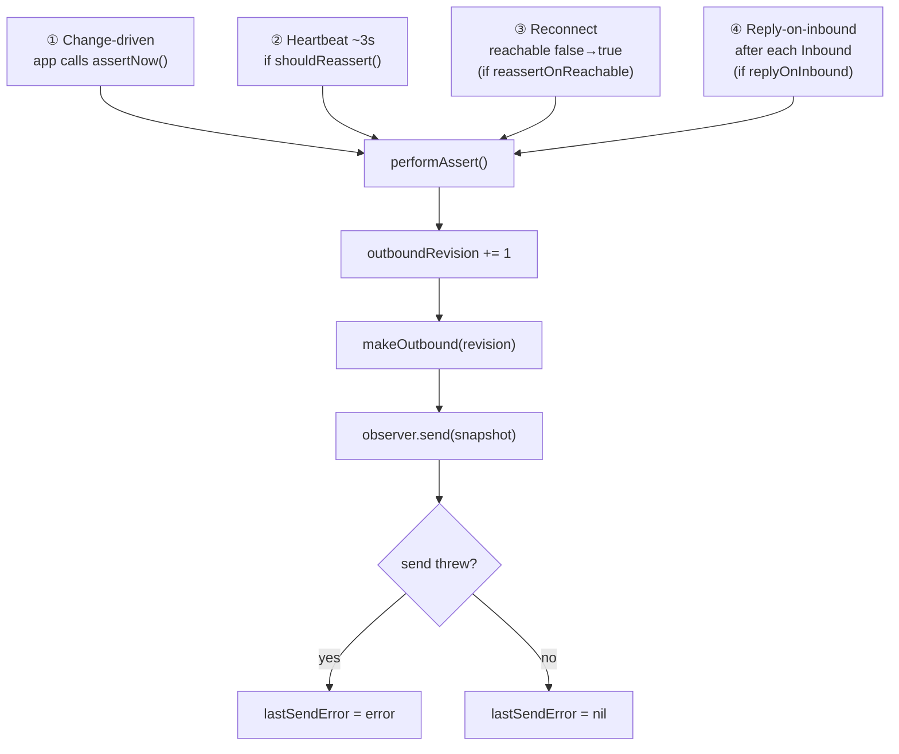
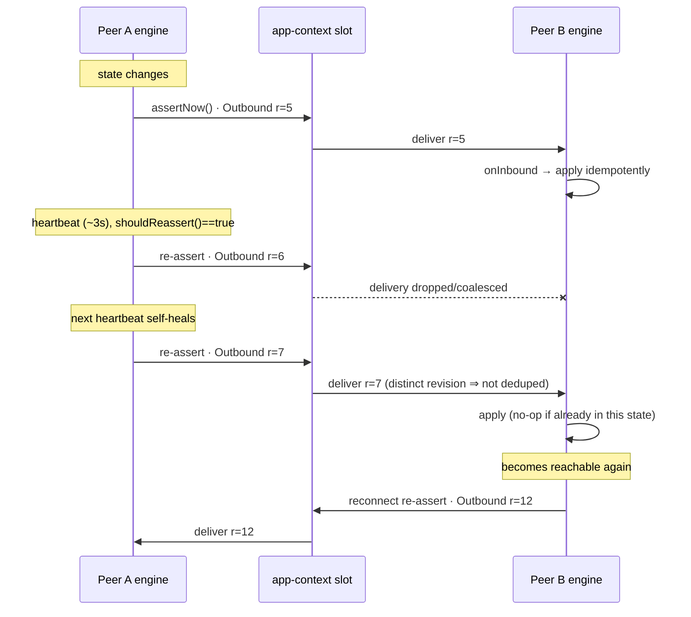
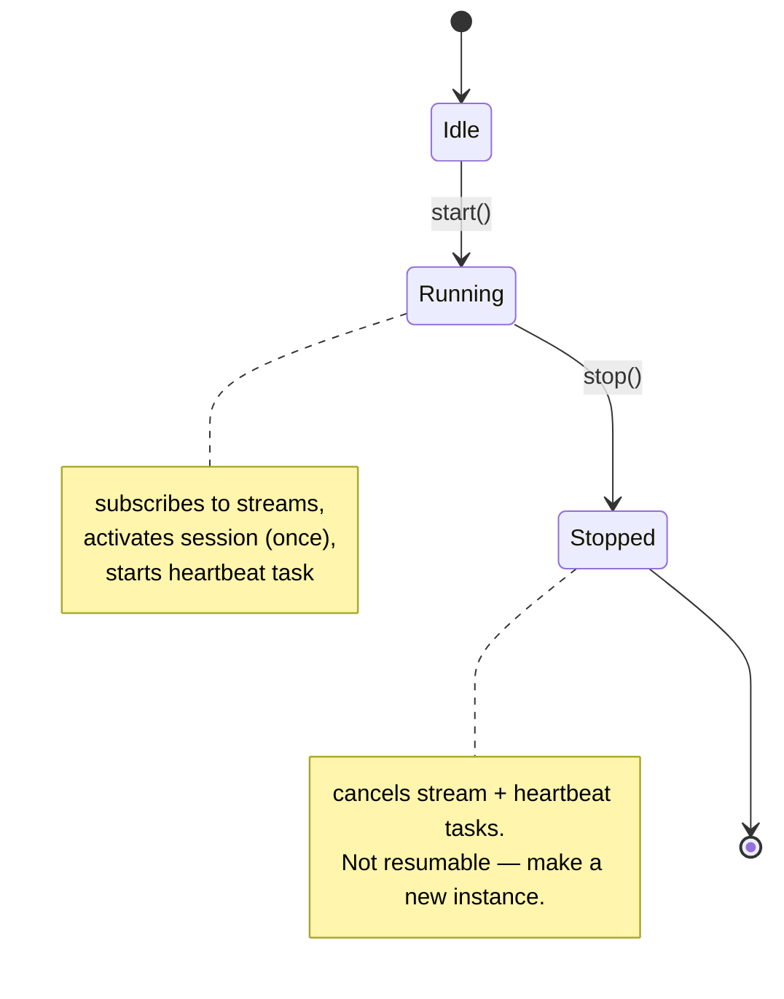

# ContextEngine

`ContextEngine<Outbound, Inbound>` is SundialKitStream's reliable, revisioned,
heartbeated **one-direction snapshot sync** over a `ConnectivityObserver`'s
WatchConnectivity **application context**. It is the reusable engine behind the
pattern described in [WATCH_COMMS_RELIABILITY.md](./WATCH_COMMS_RELIABILITY.md);
read that for the *why* (the reliability rationale and the AtLeast story). This
doc is the *how* — the engine's anatomy and runtime behavior.

If you know `CKSyncEngine`, the mental model transfers directly: the engine owns
the sync **mechanics** (a monotonic cursor, retries/re-assertion, reachability,
reconnect) while your app supplies the **domain** via closures.

| `CKSyncEngine` | `ContextEngine` |
|---|---|
| `serverChangeToken` (monotonic cursor) | `revision: UInt64` |
| delegate provides next batch to send | `makeOutbound(revision)` |
| delegate handles fetched changes | `onInbound(_:)` |
| owns retries / reachability / reconnect | heartbeat + `reassertOnReachable` |
| stateful, long-lived, you start it | `@MainActor @Observable`, `start()` / `stop()` |

---

## Mental model

Each peer (phone, watch) owns **one** `ContextEngine`. It does two things:

- **Sends** its *whole desired* `Outbound` snapshot — stamped with a fresh
  monotonic `revision` — into the single latest-wins application-context slot.
  It never sends deltas or discrete commands; every send is the complete current
  state, so a missed one is harmless once the next arrives.
- **Receives** the peer's `Inbound` snapshots and hands each to `onInbound`,
  which the app applies **idempotently** ("ensure this state", not "do this once").

`Outbound` must be a `RevisionedMessage` (carries the `revision` the engine
stamps); `Inbound` must be `Messagable` (decodable off the typed message stream).

## Anatomy

What the app plugs in, what the engine owns, and how it rides the observer:



## Every send funnels through `performAssert`

There are **four triggers** that cause a send, and all of them route through the
same `performAssert()` so that *every* send bumps the revision. That is what
makes a re-assert actually deliver: WCSession (and the receive-side dedup) drops
an application context byte-identical to the previous one, so without a changing
`revision` a heartbeat or reconnect re-assert would be silently swallowed.



## Runtime: two peers staying in sync

A representative exchange — a change on one side, the heartbeat re-asserting, and
a reconnect re-syncing. Each arrow is a complete snapshot at a new revision.



## Lifecycle



- `start()` is idempotent: only the first call activates the session. It
  subscribes to the observer's streams **before** activating, so a pending
  application context flushed at activation already has a subscriber.
- `stop()` cancels the stream and heartbeat tasks. There is no resume — create a
  new `ContextEngine` if you need to start again.

## Configuration reference

```swift
ContextEngine(
  observer: ConnectivityObserver,           // inject a mock-backed one in tests
  heartbeat: Duration = .seconds(3),         // re-assert interval
  replyOnInbound: Bool = false,              // answer every Inbound with current Outbound
  reassertOnReachable: Bool = true,          // re-sync when peer becomes reachable
  shouldReassert: @MainActor () -> Bool = { false },  // gate the heartbeat (e.g. session live)
  makeOutbound: @MainActor (UInt64) -> Outbound,      // build the snapshot at this revision
  onInbound: @MainActor (Inbound) -> Void             // apply a received snapshot, idempotently
)
```

Observable state for SwiftUI: `isReachable`, `isPairedAppInstalled`,
`lastSendError` (all `public internal(set)`).

| Knob | When to enable |
|------|----------------|
| `replyOnInbound` | A responder that should answer each request with its current state (so the peer re-syncs on every contact). |
| `reassertOnReachable` | A sender that should re-push its latest snapshot the moment a dropped connection comes back. |
| `shouldReassert` | Return `true` only while there's something worth re-asserting (e.g. a live session), so the heartbeat is silent when idle. |

## Worked example: AtLeast

AtLeast runs one engine per device. Note the two sides are configured
**asymmetrically** — the watch is the responder, the phone the requester:

| | Watch | Phone |
|---|---|---|
| Type | `ContextEngine<TimerStateUpdate, SessionIntent>` | `ContextEngine<SessionIntent, TimerStateUpdate>` |
| `makeOutbound` | current `TimerState` → `TimerStateUpdate` | desired `SessionIntent` |
| `onInbound` | reconcile intent → idempotent apply | update mirrored timer state |
| `replyOnInbound` | **true** — answers every phone intent with its state | false |
| `shouldReassert` | timer `.running` | session presented |
| `reassertOnReachable` | false | false |

Because the watch replies to every inbound intent and both sides heartbeat their
latest snapshot, the link self-heals without either side needing
`reassertOnReachable` here. See `ConnectivityService.makeSync()` for the wiring.

## See also

- [WATCH_COMMS_RELIABILITY.md](./WATCH_COMMS_RELIABILITY.md) — the reliability
  rationale, `RevisionedMessage` / `ExpiringMessage` / `StaleWindow`, and the
  structured-logging trace for debugging the link.
- [DEBUGGING.md](./DEBUGGING.md) — streaming both devices' logs and correlating
  by `revision`.
